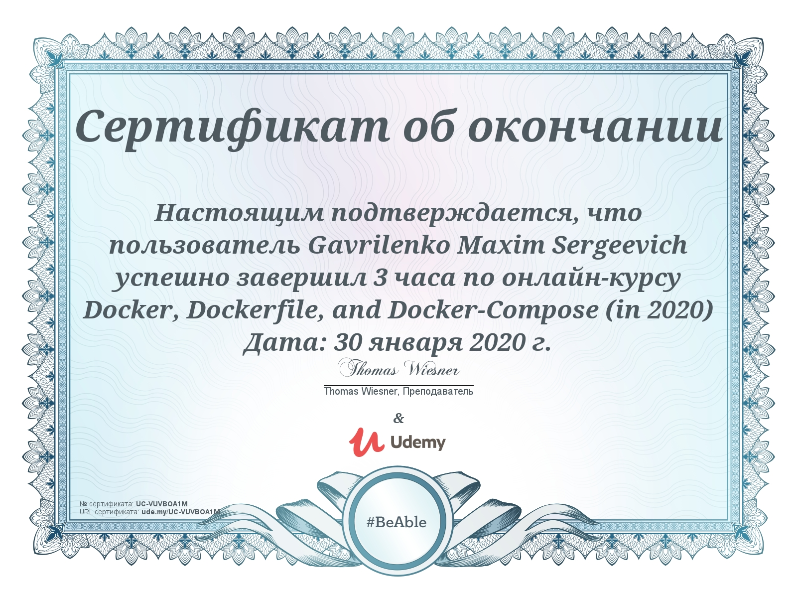

# udemy-docker

Docker, Dockerfile, and Docker-Compose (2020 ready!)
Learn Docker, Containers vs. Images, Dockerfile, Docker-Compose -- With Practical Hands-On Exercises.


### Course (video)
https://www.udemy.com/course/docker-and-docker-compose-hands-on-by-example/

Thomas Wiesner. Teaching over 60,000 Students about Development (https://www.facebook.com/tomscourses/)

### What you will learn
- You will learn to use Docker with Hands-On Demos and Exercises
- Know the most important Docker-Run Flags and Everyday Use-Cases
- Be able to read, understand and write your own Dockerfiles
- Read and write your own docker-compose yaml files
- Understand the difference between Host-Volume and Named-Volume mounting
- Improve real-world docker-compose yaml files\

### Steps:
- <b>Part 1 and 2</b>: Introduction and install docker to desktop
- <b>Part 3</b>: Docker run and  docker commands
- <b>Part 4</b>: Dockerfile and docker commands
- <b>Part 5</b>: Docker-compose. Volumes and docker-compose + dockerfile
- <b>Part 6</b>: Networks and docker, docker-compose
- <b>Part 7</b>: Examples

### Helpful documentation
#### Docker:
https://docs.docker.com/

For example "MariaDB doc and env-variable": https://hub.docker.com/_/mariadb
#### docker-compose:
https://docs.docker.com/compose/

For example "Quickstart: Compose and WordPress": https://docs.docker.com/compose/wordpress/

or in DocherHub: https://hub.docker.com/_/wordpress

### useful documentation:
dockerfile best practices: https://docs.docker.com/develop/develop-images/dockerfile_best-practices/


### Main commands and features
#### general commands with Docker
```dotenv
# show all containers
docker ps -a

# build image with tag (with Dockerfile)
docker build -t myphpapp .

# run docker-container from image ubuntu
docker run -it ubuntu /bin/bash

# start docker-container when it stops
docker start container_name

# attach docker-container (like exec + bash)
docker attach container_name

# stop docker-container
docker stop container_name

# remove docker-container
docker rm container_name

# remove image
docker rmi image_name_or_tag

# Run container from image 'ubuntu' in interactive mode (-it)
# with attached volume 'my-vol' (-v)
# with name linux1, detached
# and remove the container when it will stop (--rm)
docker run -v my-vol:/my-data --rm -it -d --name linux1 ubuntu /bin/bash

# run docker-container from image ubuntu with shared directory with host machine
docker run --rm -v ${PWD}:/myvol ubuntu /bin/bash -c "ls -lha > /myvol/myfile.txt"

# create container from image with port mapping and volume mointing
docker run -d --rm -p 8080:80 -v ${PWD}:/var/www/html php:7.4-apache

```

#### volumes
```dotenv
# create volume with name 'my-vol'
docker volume create --name my-vol

# show all volumes
docker volume ls

# remove volume with name 'my-vol' 
docker volume rm my-vol
```
#### networks
```dotenv
# create network and start container which use this network
docker network create simple-network
docker run --rm -d --name my-webserver --network simple-network httpd

# run docker container with port mapping
docker run -p 8080:8000 myphpapp:web

# run container with port mapping and name
docker run --name myphp-apache -p 8080:80 myphpapp:apache

# show all networks
docker network ls

# remove volume with name 'my-vol' 
docker network rm my-network

# remove all networks not used by at least one container (now) 
docker network prune
```
#### docker-compose commands
```dotenv
# start container/s and detach
docker-compose up -d

# build/rebuild container
docker-compose up --build

# list of started containers
docker-compose ps 

# stop and remove containers and networks
docker-compose down
```

#### Dockerfile
```dotenv
# set image from dockerhub
FROM php:7.4-apache

RUN apt-get -y update \
&& apt-get install -y libicu-dev \
&& docker-php-ext-configure intl \
&& docker-php-ext-install intl

RUN docker-php-ext-install mysqli && docker-php-ext-enable mysqli

# set file|catalog wich we use in web-server
COPY index.php /var/www/html

# use port
EXPOSE 8000

# after container start
CMD ["php", "-S", "0.0.0.0:8000"]

```

#### docker-compose.yml
```dotenv
version: '3.7'

services:
  web:
    image: nginx:alpine
    container_name: udemy-web
    volumes:
      - ./nginx.conf:/etc/nginx/nginx.conf
    ports:
      - 8090:80
    networks:
      - app1_net
      - app2_net

  app1:
    image: httpd:latest
    container_name: udemy-app1
    networks:
      - app1_net

  app2:
    image: httpd:latest
    container_name: udemy-app2
    networks:
      - app2_net

networks:
  app1_net:
  app2_net:
```

#### Examples
```dotenv
# EXAMPLE 1: (Lesson3.3-Shared-Volume-Mounting)

# unpackage some archive throught container and remove it
# https://hub.docker.com/r/klutchell/rar
# flag -w for working directory (like cd)
docker run --rm -v ${PWD}:/files -w /files klutchell/rar a /files/myrar.rar /files/myfile.txt

# EXAMPLE 2: (Part3-Docker-Run/Lesson3.4-PHP-with-volume-mounting)

# PHP-with-volume-mounting
# create container from php-image
docker run -it --rm -v ${PWD}:/my-files -w /my-files --name php-script php:7.4-cli /bin/bash

# create php-file from console of container:
echo '<?php echo "ml test";' > index.php

# exit from container and try to run:
docker run -it --rm -v ${PWD}:/my-files -w /my-files --name php-script php:7.4-cli php index.php

# EXAMPLE 3:


```

#### Push image to docker-hub
1. register or login in https://hub.docker.com/
2. login to docker-hub in your pc [bash]:
    ```dotenv
    docker login
    ``` 
3. create Dockerfile:
    ```dotenv
    FROM alpine
    
    RUN apk update && apk add curl;
    
    ENTRYPOINT ["curl"]
    ``` 
4. in bash:
    ```dotenv
    docker run mycurl google.com
    ```
5. re-tag image:
    ```dotenv
    docker tag mycurl maxlenash/mycurl:latest
    ```
6. push image to docker-hub:
    ```dotenv
    docker push maxlenash/mycurl:latest
    ```
7. that's all. Now we can execute:
    ```dotenv
    docker run --rm maxlenash/mycurl google.com
    ```
8. remove unnecessary:
    ```dotenv
    docker rmi mycurl maxlenash/mycurl
    ```
   
   
#### Done


